# Robust Object Detection on VisDrone

객체 탐지 모델의 이미지 열화(corruption) 조건에서의 강건성(Robustness)을 실험적으로 분석하고, corruption augmentation을 통한 개선 효과를 검증하는 프로젝트.

**이미지 탐지(VisDrone-DET)**와 **비디오 탐지(VisDrone-VID)** 두 도메인에서 실험을 진행하였다.

## Research Question

> Clean 이미지에서 학습된 객체 탐지 모델은 실환경의 열화 조건(노이즈, 블러, 저해상도)에서도 성능을 유지하는가? 그리고 corruption augmentation 또는 image restoration 전처리를 적용하면 강건성이 얼마나 개선되는가? 해당 전략은 비디오 데이터에서도 동일하게 유효한가?

## Demo: Baseline vs Augmented (Blur)

Blur 이미지에서 Baseline 모델은 대부분의 객체를 탐지하지 못하지만, Augmented 모델은 약 **2배 더 많은 객체를 탐지**합니다.

### Faster R-CNN
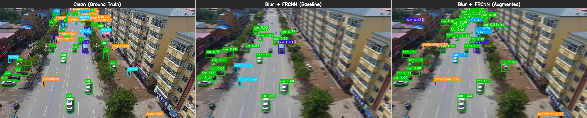
> GT: 102개 | Baseline: **19개** (19%) | Augmented: **50개** (49%) — 2.6배 개선

### YOLOv8m
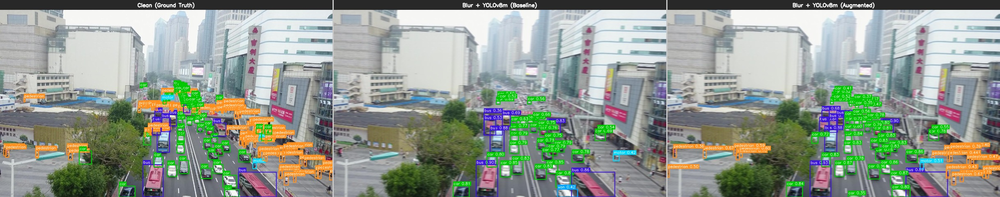
> GT: 170개 | Baseline: **38개** (22%) | Augmented: **75개** (44%) — 2.0배 개선

### RT-DETR-L
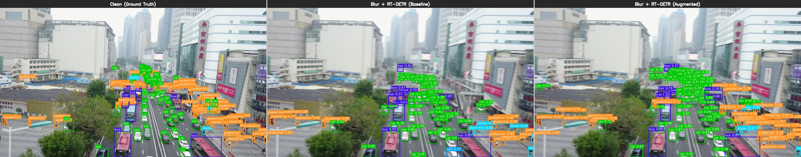
> GT: 170개 | Baseline: **94개** (55%) | Augmented: **162개** (95%) — 1.7배 개선

## Key Results

### 3-Strategy Comparison (Baseline vs Augmented vs Restored)

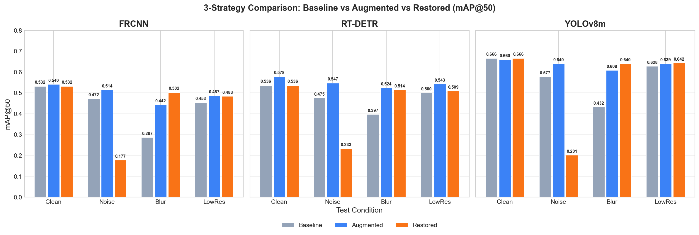

3가지 강건성 전략을 비교한 결과:
- **Baseline**: Clean 이미지로만 학습
- **Augmented**: Corruption augmentation으로 학습
- **Restored**: U-Net으로 이미지 복원 후 Baseline 모델로 추론

| Model | Strategy | Clean | Noise | Blur | LowRes |
|---|---|---:|---:|---:|---:|
| FasterRCNN | Baseline | 0.532 | 0.472 | 0.287 | 0.454 |
| | Augmented | 0.540 | **0.514** | 0.442 | 0.487 |
| | Restored | 0.532 | 0.177 | **0.502** | 0.483 |
| RT-DETR-L | Baseline | 0.536 | 0.475 | 0.397 | 0.500 |
| | Augmented | **0.578** | **0.547** | **0.524** | **0.543** |
| | Restored | 0.536 | 0.233 | 0.514 | 0.509 |
| YOLOv8m | Baseline | **0.666** | 0.577 | 0.432 | 0.628 |
| | Augmented | 0.660 | **0.640** | 0.608 | 0.639 |
| | Restored | **0.666** | 0.201 | **0.640** | **0.642** |

### Strategy Effectiveness

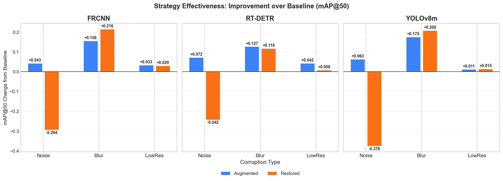

### Best Strategy per Condition

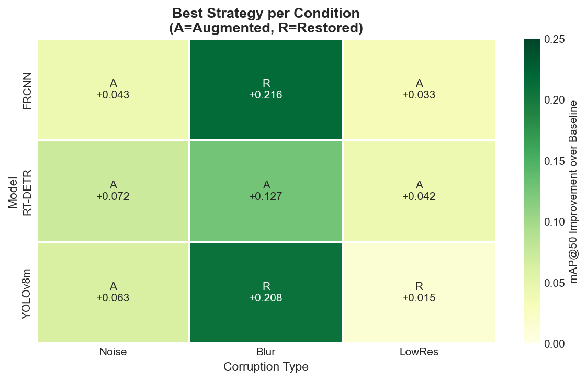

### Robustness Profile (3 Strategies)

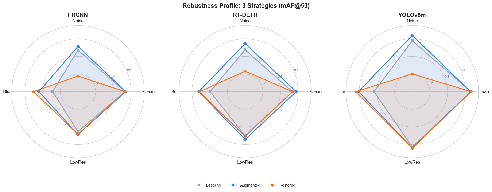

### Baseline vs Augmented (6 models)

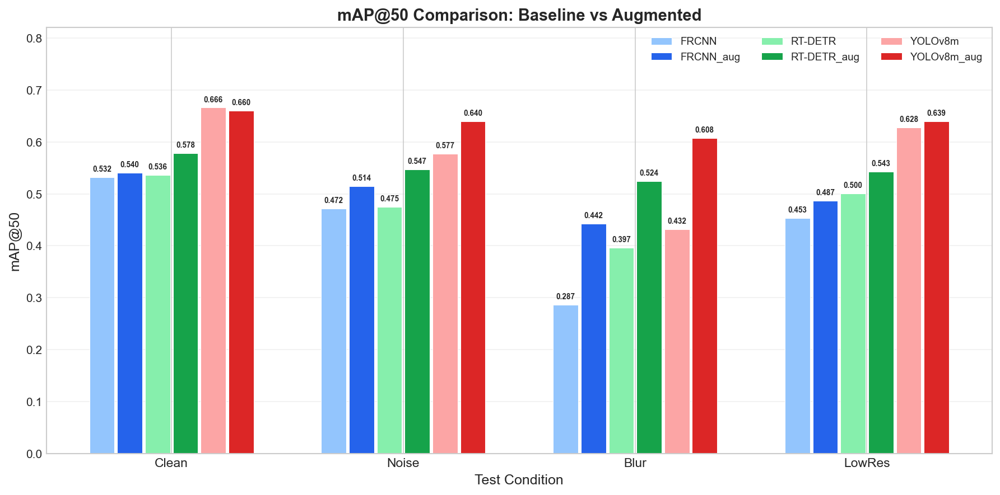

### Degradation from Clean

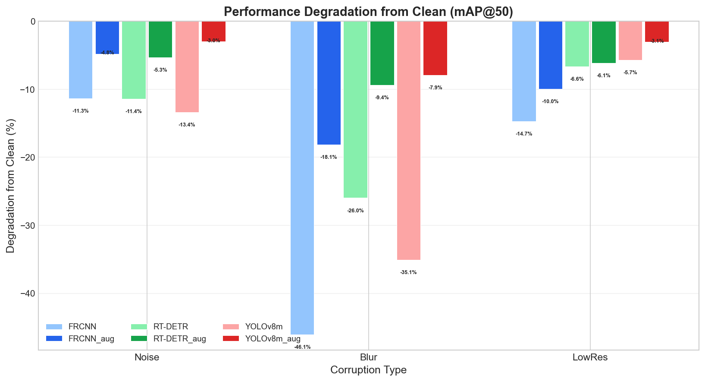

### Per-Class AP@50 (Blur)

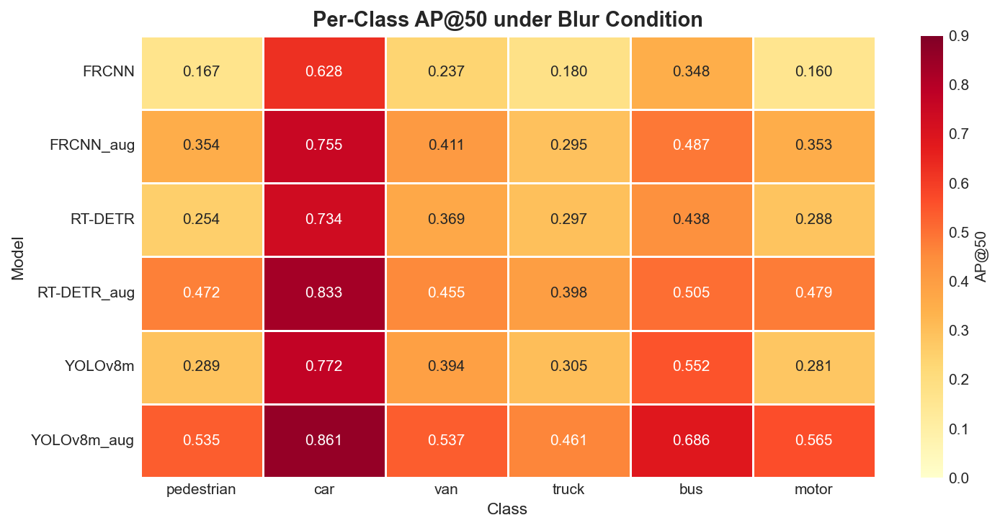

## Key Findings

### Image Detection (VisDrone-DET)

1. **Blur is the most critical corruption**: up to -46.1% mAP drop for Faster R-CNN baseline
2. **Corruption augmentation is the most robust strategy overall**: consistent improvement across all conditions
3. **Image restoration excels at deblurring**: Restored strategy achieves best Blur performance (FRCNN +0.216, YOLOv8 +0.208)
4. **Restoration fails on noise**: U-Net over-smoothing destroys texture information, causing severe detection drops (-62~65%)
5. **YOLOv8m_aug achieves best overall robustness**: only -3.0% ~ -7.9% degradation across all conditions
6. **Optimal strategy depends on corruption type**: Augmented for noise, Restored for blur, both effective for low-resolution

### Video Detection (VisDrone-VID)

7. **Corruption augmentation is equally effective in video domain**: Blur degradation reduced from -38.3% → -9.1% (YOLOv8m), -30.9% → -4.5% (RT-DETR-L)
8. **RT-DETR-L_aug achieves remarkable Blur robustness**: only -4.5% drop under Blur — best among all video models
9. **Findings generalize across domains**: DET와 VID 모두 동일한 패턴 (Blur 최취약, Augmentation 일관 효과적)

## Experiment Design

### Image Detection (VisDrone-DET)

#### Models (3 architectures)

| Model | Type | Framework |
|---|---|---|
| Faster R-CNN (ResNet-50 FPN v2) | 2-Stage CNN | torchvision |
| RT-DETR-L | Transformer | Ultralytics |
| YOLOv8m | 1-Stage CNN | Ultralytics |

#### Dataset

- **VisDrone-DET** (drone-view object detection)
- 6 classes: pedestrian, car, van, truck, bus, motor
- COCO format (Faster R-CNN) + YOLO format (RT-DETR, YOLOv8)

#### Robustness Strategies (3 types)

- **Baseline**: Clean 데이터로만 학습 → 열화 이미지 직접 추론
- **Augmented**: 학습 시 50% 확률로 corruption(noise/blur/lowres 중 랜덤 1개) 적용
- **Restored**: Lightweight U-Net (3.70M params)으로 이미지 복원 후 Baseline 모델로 추론
  - 복원 모델: PSNR 34.03dB, SSIM 0.947 달성

**Total Evaluations: 9 configurations x 4 test sets = 36**

---

### Video Detection (VisDrone-VID)

#### Models (2 architectures)

| Model | Type | Framework |
|---|---|---|
| RT-DETR-L | Transformer | Ultralytics |
| YOLOv8m | 1-Stage CNN | Ultralytics |

#### Dataset

- **VisDrone-VID** (drone-view video sequences, frame-level detection)
- 6 classes: pedestrian, car, van, truck, bus, motor
- YOLO format (프레임 단위 추출)

#### Robustness Strategies (2 types)

- **Baseline**: Clean 데이터로만 학습
- **Augmented**: 학습 시 50% 확률로 corruption 적용

#### Video Model Results (mAP@50)

| Model | Clean | Noise | Blur | LowRes |
|---|---:|---:|---:|---:|
| YOLOv8m-VID Baseline | 0.387 | 0.330 | 0.239 | 0.309 |
| YOLOv8m-VID Augmented | **0.409** | **0.391** | **0.372** | **0.385** |
| RT-DETR-VID Baseline | 0.316 | 0.287 | 0.218 | 0.265 |
| RT-DETR-VID Augmented | **0.335** | **0.319** | **0.320** | **0.310** |

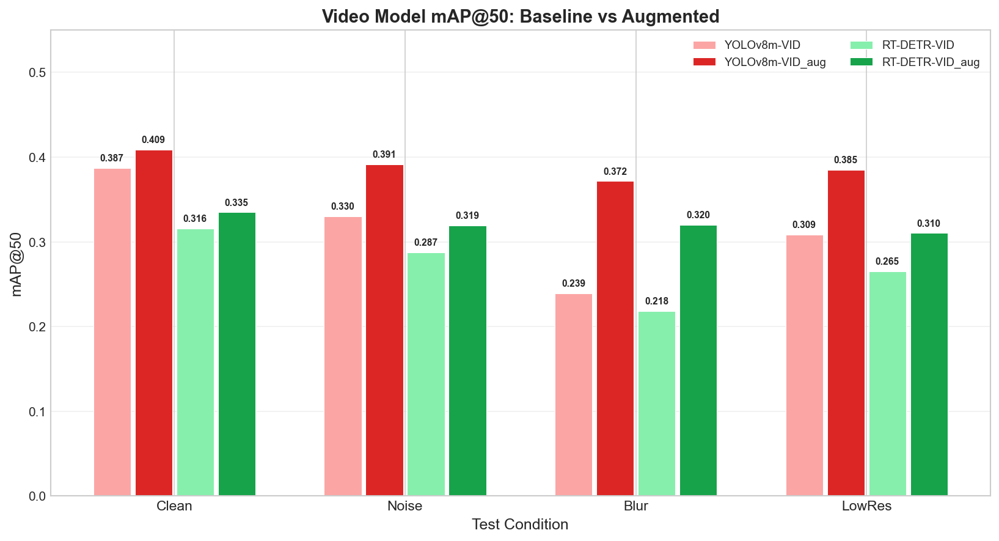

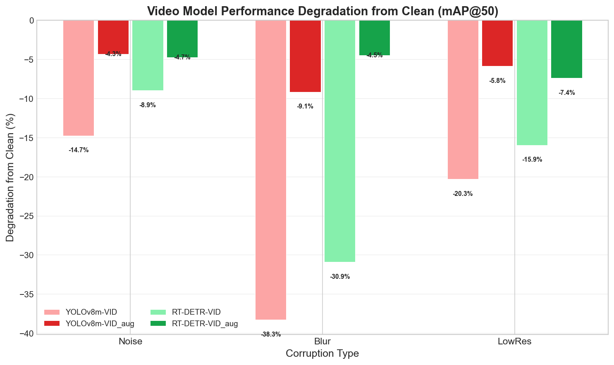

**Total Evaluations: 4 configurations x 4 test sets = 16**

---

### Test Conditions (공통, 4 types)

| Condition | Description | Parameter |
|---|---|---|
| Clean | Original images | - |
| Noise | Gaussian noise | sigma=15 |
| Blur | Motion blur | kernel=9, angle=0 deg |
| LowRes | Downscale + upscale | factor=0.5x |

## Project Structure

```
Robust-Object-Detection/
├── scripts/
│   ├── augmentations.py                 # Shared corruption augmentation module
│   ├── convert_visdrone_to_coco.py      # VisDrone-DET -> COCO format
│   ├── convert_visdrone_to_yolo.py      # VisDrone-DET -> YOLO format
│   ├── convert_visdrone_vid_to_yolo.py  # VisDrone-VID -> YOLO format (frame extraction)
│   ├── build_corrupted_testsets.py      # Generate corrupted test sets
│   ├── coco_detection_dataset.py        # PyTorch Dataset for COCO format
│   ├── train_frcnn_baseline.py          # Faster R-CNN baseline training
│   ├── train_frcnn_augmented.py         # Faster R-CNN augmented training
│   ├── train_rtdetr_augmented.py        # RT-DETR-L augmented training (DET)
│   ├── train_yolo_augmented.py          # YOLOv8m augmented training (DET)
│   ├── train_vid_yolo_baseline.py       # YOLOv8m baseline training (VID)
│   ├── train_vid_yolo_augmented.py      # YOLOv8m augmented training (VID)
│   ├── train_vid_rtdetr_baseline.py     # RT-DETR-L baseline training (VID)
│   ├── train_vid_rtdetr_augmented.py    # RT-DETR-L augmented training (VID)
│   ├── eval_all.py                      # DET evaluation (6x4=24 runs)
│   ├── eval_vid.py                      # VID evaluation (4x4=16 runs)
│   ├── restoration_net.py               # Restoration U-Net model
│   ├── train_restoration.py             # Restoration model training
│   ├── restore_testsets.py              # Apply restoration to test sets
│   ├── eval_restored.py                 # Evaluate on restored test sets
│   ├── plot_results.py                  # DET: Baseline vs Augmented visualization
│   ├── plot_three_strategies.py         # DET: 3-strategy comparison visualization
│   ├── plot_vid_results.py              # VID: Baseline vs Augmented visualization
│   └── demo_inference.py               # Demo comparison images
├── experiments/
│   ├── frcnn/                           # Faster R-CNN results (DET)
│   ├── rtdetr/                          # RT-DETR-L results (DET)
│   ├── yolo/                            # YOLOv8m results (DET)
│   ├── vid_rtdetr/                      # RT-DETR-L results (VID)
│   ├── vid_yolo/                        # YOLOv8m results (VID)
│   ├── restoration/                     # Restoration model checkpoints
│   ├── figures/                         # Visualization charts
│   ├── demo/                            # Demo comparison images
│   ├── eval_results.json                # DET Baseline/Augmented evaluation results
│   ├── eval_restored_results.json       # DET Restored evaluation results
│   └── vid_eval_results.json            # VID evaluation results
├── docs/
│   ├── 01_baseline_eval_results.md      # DET: Baseline evaluation analysis
│   ├── 02_augmented_training.md         # DET: Augmented training details
│   ├── 03_final_comparison.md           # DET: Final comparison analysis
│   ├── 04_visualization.md              # DET: Visualization guide
│   ├── 05_demo_inference.md             # DET: Demo inference analysis
│   ├── 06_restoration_experiment.md     # DET: Image restoration & 3-strategy comparison
│   └── 07_vid_experiment.md             # VID: Video model experiment report
└── data/                                # (gitignored)
    ├── processed/                        # Processed datasets
    └── testsets/                         # Corrupted test sets
```

## Setup

### Requirements

- Python 3.11+
- PyTorch 2.5+
- CUDA-compatible GPU (tested on RTX 3070 Ti 8GB)

```bash
pip install torch torchvision ultralytics pycocotools opencv-python numpy matplotlib seaborn
```

### Data Preparation

```bash
# 1. Download VisDrone-DET dataset and place in data/raw/

# 2. Convert to COCO/YOLO format
python -m scripts.convert_visdrone_to_coco
python -m scripts.convert_visdrone_to_yolo

# 3. Generate corrupted test sets
python -m scripts.build_corrupted_testsets
```

### Image Detection Training (VisDrone-DET)

```bash
# Baseline (clean only)
python -m scripts.train_frcnn_baseline

# Augmented (with corruption augmentation)
python -m scripts.train_frcnn_augmented
python -m scripts.train_rtdetr_augmented
python -m scripts.train_yolo_augmented
```

### Image Restoration

```bash
# Train restoration U-Net
python -m scripts.train_restoration

# Restore corrupted test sets
python -m scripts.restore_testsets
```

### Video Detection Training (VisDrone-VID)

```bash
# Convert VisDrone-VID to YOLO format
python -m scripts.convert_visdrone_vid_to_yolo

# Baseline
python -m scripts.train_vid_yolo_baseline
python -m scripts.train_vid_rtdetr_baseline

# Augmented
python -m scripts.train_vid_yolo_augmented
python -m scripts.train_vid_rtdetr_augmented
```

### Evaluation & Visualization

```bash
# DET: Baseline/Augmented evaluations (24 runs)
python -m scripts.eval_all

# DET: Restored evaluations (12 runs)
python -m scripts.eval_restored

# VID: Evaluations (16 runs)
python -m scripts.eval_vid

# Generate charts
python -m scripts.plot_results
python -m scripts.plot_three_strategies
python -m scripts.plot_vid_results

# Generate demo comparison images
python -m scripts.demo_inference
```

## Environment

- GPU: NVIDIA GeForce RTX 3070 Ti (8GB)
- OS: Windows 11
- Python 3.11, PyTorch 2.5.1, Ultralytics 8.3.209
