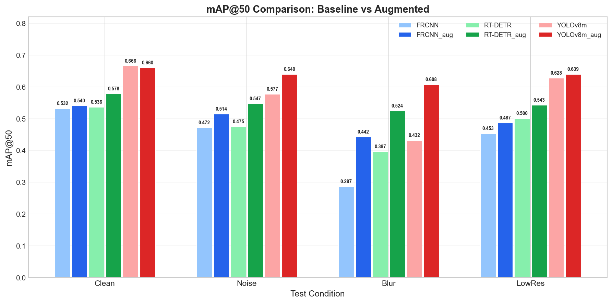
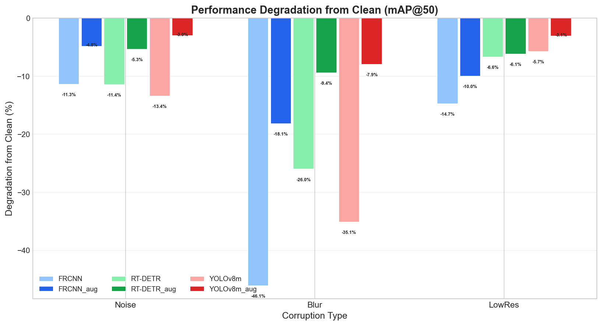
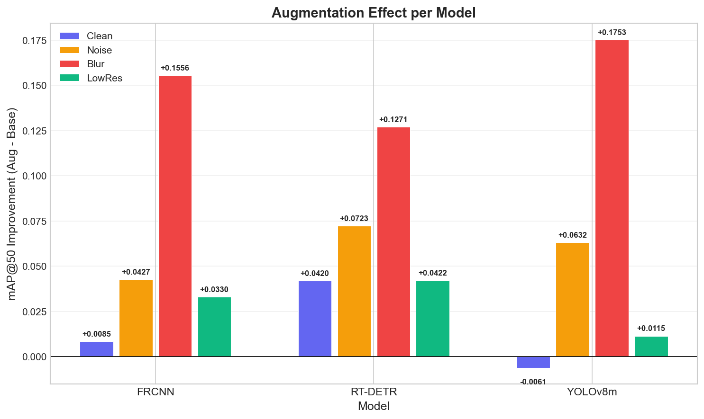
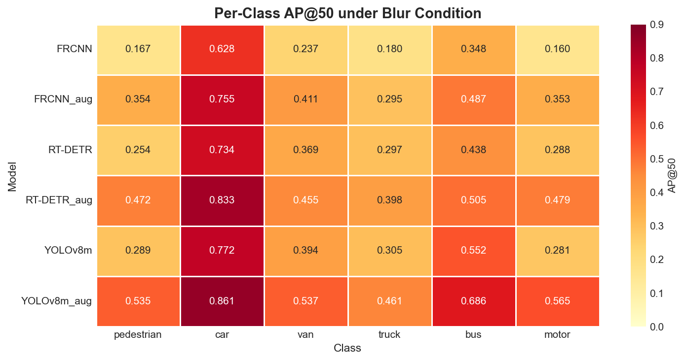
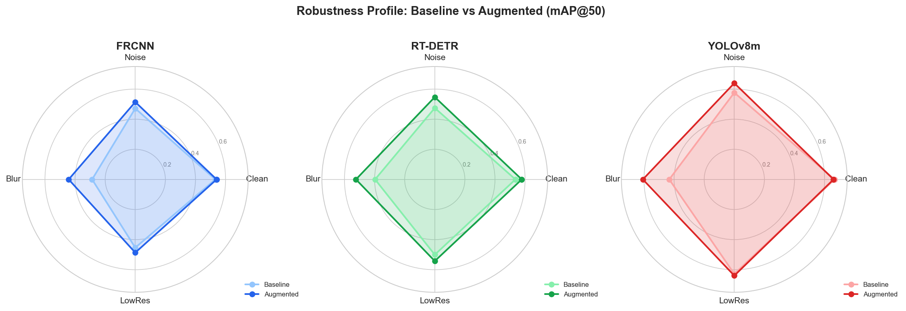

# 결과 시각화

`scripts/plot_results.py`로 생성된 5개 그래프에 대한 설명.

데이터 소스: `experiments/eval_results.json` (6 모델 x 4 테스트셋 = 24회 평가 결과)

---

## 1. mAP@50 전체 비교



6개 모델의 mAP@50을 4개 테스트 조건별로 비교한 그래프.

- 연한 색 = Baseline (Clean으로만 학습), 진한 색 = Augmented (corruption augmentation 적용)
- 파랑 = Faster R-CNN, 초록 = RT-DETR-L, 빨강 = YOLOv8m

**관찰 포인트:**
- Clean에서 YOLOv8m이 0.666으로 압도적 1위이며, Augmented 후에도 0.660으로 거의 유지
- Blur 조건에서 Baseline과 Augmented의 차이가 가장 크게 나타남 (FRCNN: 0.287 -> 0.442)
- Augmented 모델은 모든 corruption 조건에서 Baseline보다 높은 성능을 보임
- RT-DETR-L_aug는 Clean에서도 0.536 -> 0.578로 향상되어 정규화 효과를 보여줌

---

## 2. 성능 하락률 비교



Clean 대비 각 corruption 조건에서의 mAP@50 하락률(%).

- 막대가 아래로 길수록 해당 corruption에 취약함을 의미
- Baseline(연한 색)과 Augmented(진한 색)를 직접 비교

**관찰 포인트:**
- Blur가 가장 치명적: Baseline FRCNN은 -46.1%, YOLOv8m은 -35.1% 하락
- Augmented 모델은 하락폭이 크게 줄어듦: FRCNN -46.1% -> -18.1%, YOLOv8m -35.1% -> -7.9%
- YOLOv8m_aug가 모든 조건에서 가장 낮은 하락률 (-3.0% ~ -7.9%)
- Noise와 LowRes에서도 Augmented가 일관되게 Baseline보다 강건

---

## 3. Augmentation 개선폭



모델별 Augmented - Baseline mAP@50 차이.

- 양수 = Augmented가 더 높음, 음수 = Baseline이 더 높음
- 색상은 조건별: 보라 = Clean, 주황 = Noise, 빨강 = Blur, 초록 = LowRes

**관찰 포인트:**
- Blur(빨강)에서 3개 모델 모두 가장 큰 개선: FRCNN +0.1556, RT-DETR +0.1271, YOLOv8 +0.1753
- YOLOv8m의 Clean은 유일하게 미세 하락(-0.0061)이나, 실질적으로 무시 가능한 수준
- RT-DETR은 Clean에서도 +0.0420으로 가장 높은 Clean 개선 (정규화 효과)
- Noise(주황)에서도 +0.04~0.07의 일관된 개선

---

## 4. 클래스별 AP@50 히트맵 (Blur 조건)



Blur 조건에서 6개 모델 x 6개 클래스의 AP@50을 히트맵으로 표현.

- 진한 색(빨강) = 높은 AP, 연한 색(노랑) = 낮은 AP
- 행: 모델 (위에서 아래로 Baseline/Augmented 쌍), 열: 클래스

**관찰 포인트:**
- Car가 모든 모델에서 가장 높은 AP (0.628~0.861): 크기가 크고 형태가 일정하여 Blur에도 강건
- Pedestrian과 Motor가 Baseline에서 가장 취약 (FRCNN: 0.167, 0.160)
- Augmented 후 소형 객체 개선이 두드러짐: FRCNN pedestrian 0.167 -> 0.354, motor 0.160 -> 0.353
- YOLOv8m_aug가 전 클래스에서 가장 진한 색 (전체적으로 가장 높은 AP)
- 아래 행(Augmented)이 위 행(Baseline)보다 전반적으로 진한 색상 = 클래스 전반에 걸쳐 개선

---

## 5. 강건성 레이더 차트



각 모델 쌍(Baseline vs Augmented)의 4개 조건 mAP@50을 레이더 차트로 표현.

- 연한 색 영역 = Baseline, 진한 색 영역 = Augmented
- Augmented 영역이 Baseline을 감싸면 = 모든 조건에서 개선됨

**관찰 포인트:**
- 3개 모델 모두 Augmented(진한 색)가 Baseline(연한 색)을 감싸는 형태
- FRCNN: Blur 방향으로 가장 큰 확장 (0.287 -> 0.442)
- RT-DETR: 전체적으로 균일하게 확장 (가장 균형 잡힌 개선)
- YOLOv8m: 원래 가장 큰 영역이었는데, Augmented 후 더 원에 가까워짐 (= 균일한 강건성)

---

## 생성 방법

```bash
python -m scripts.plot_results
```

출력 디렉토리: `experiments/figures/`

---

*생성일: 2026-02-12*
