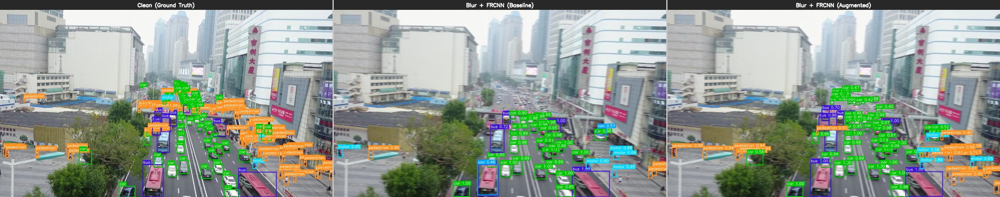
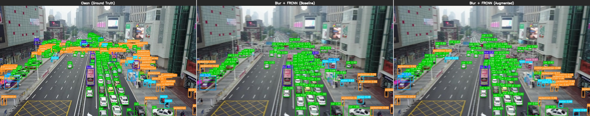
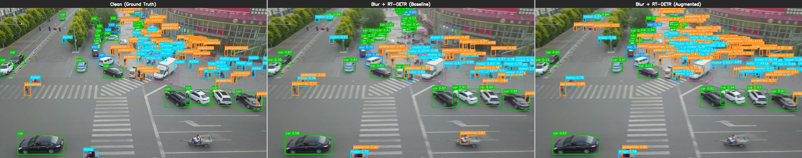
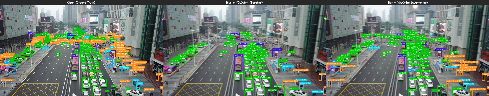
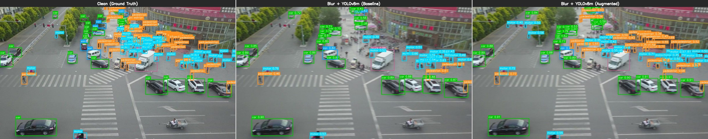

# 추론 데모: Baseline vs Augmented 비교

## 개요

Blur 조건의 실제 이미지에 대해 Baseline과 Augmented 모델의 탐지 결과를 나란히 비교한다. 각 이미지는 3패널 구성:

- **왼쪽**: Clean 원본 + Ground Truth (정답 박스)
- **가운데**: Blur 이미지 + Baseline 모델 탐지 결과
- **오른쪽**: Blur 이미지 + Augmented 모델 탐지 결과

신뢰도 임계값: 0.35 (모든 모델 동일)

---

## Faster R-CNN

### 예시 1 (GT=170개 객체)



- Baseline: 170개 중 **41개** 탐지 (24%)
- Augmented: 170개 중 **74개** 탐지 (44%)
- **Augmented가 1.8배 더 많은 객체를 탐지**

### 예시 2 (GT=262개 객체)



- Baseline: 262개 중 **83개** 탐지 (32%)
- Augmented: 262개 중 **100개** 탐지 (38%)

### 예시 3 (GT=102개 객체)


- Baseline: 102개 중 **19개** 탐지 (19%)
- Augmented: 102개 중 **50개** 탐지 (49%)
- **Augmented가 2.6배 더 많은 객체를 탐지** - 가장 극적인 차이

---

## RT-DETR-L

### 예시 1 (GT=170개 객체)


- Baseline: 170개 중 **94개** 탐지 (55%)
- Augmented: 170개 중 **162개** 탐지 (95%)
- **Augmented가 거의 모든 객체를 탐지**

### 예시 2 (GT=137개 객체)



- Baseline: 137개 중 **101개** 탐지 (74%)
- Augmented: 137개 중 **165개** 탐지 (GT보다 많음 - 일부 오탐 포함)

---

## YOLOv8m

### 예시 1 (GT=170개 객체)


- Baseline: 170개 중 **38개** 탐지 (22%)
- Augmented: 170개 중 **75개** 탐지 (44%)
- **Augmented가 약 2배 더 많은 객체를 탐지**

### 예시 2 (GT=262개 객체)



- Baseline: 262개 중 **73개** 탐지 (28%)
- Augmented: 262개 중 **125개** 탐지 (48%)

### 예시 3 (GT=137개 객체)



- Baseline: 137개 중 **43개** 탐지 (31%)
- Augmented: 137개 중 **82개** 탐지 (60%)
- **Augmented가 약 1.9배 더 많은 객체를 탐지**

---

## 탐지 수 요약

| Model | Image | GT | Baseline | Augmented | 배율 |
|---|---|---:|---:|---:|---:|
| FRCNN | img0348 | 111 | 51 | 76 | 1.5x |
| FRCNN | img0366 | 170 | 41 | 74 | 1.8x |
| FRCNN | img0373 | 262 | 83 | 100 | 1.2x |
| FRCNN | img0161 | 102 | 19 | 50 | **2.6x** |
| FRCNN | img0445 | 137 | 48 | 84 | 1.8x |
| RT-DETR | img0348 | 111 | 92 | 154 | 1.7x |
| RT-DETR | img0366 | 170 | 94 | 162 | 1.7x |
| RT-DETR | img0373 | 262 | 166 | 209 | 1.3x |
| RT-DETR | img0161 | 102 | 77 | 62 | 0.8x |
| RT-DETR | img0445 | 137 | 101 | 165 | 1.6x |
| YOLOv8m | img0348 | 111 | 37 | 61 | 1.6x |
| YOLOv8m | img0366 | 170 | 38 | 75 | **2.0x** |
| YOLOv8m | img0373 | 262 | 73 | 125 | 1.7x |
| YOLOv8m | img0161 | 102 | 18 | 34 | 1.9x |
| YOLOv8m | img0445 | 137 | 43 | 82 | 1.9x |

## 핵심 관찰

1. **Augmented 모델은 Blur 이미지에서 평균 1.5~2배 더 많은 객체를 탐지**
2. 특히 소형 객체(pedestrian, motor)에서 Baseline은 거의 탐지 못하지만 Augmented는 상당수 탐지
3. RT-DETR_aug가 가장 많은 탐지 수를 보이나, GT보다 많은 경우 일부 오탐(false positive) 포함
4. Clean 이미지(왼쪽)와 비교하면 Blur로 인한 정보 손실이 얼마나 심각한지 시각적으로 확인 가능

---

## 생성 방법

```bash
python -m scripts.demo_inference
```

출력 디렉토리: `experiments/demo/`

---

*생성일: 2026-02-12*
