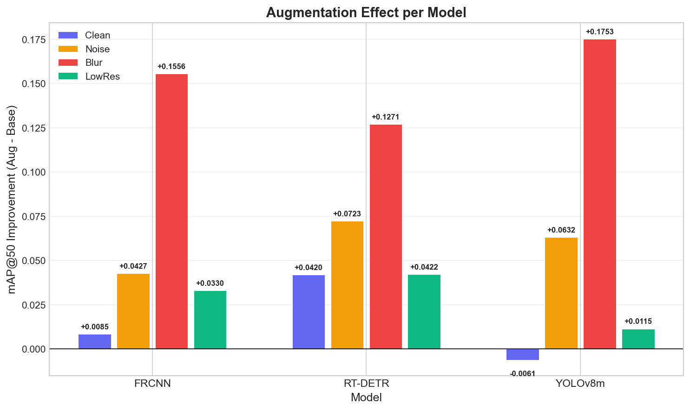
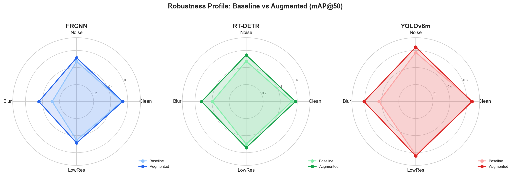
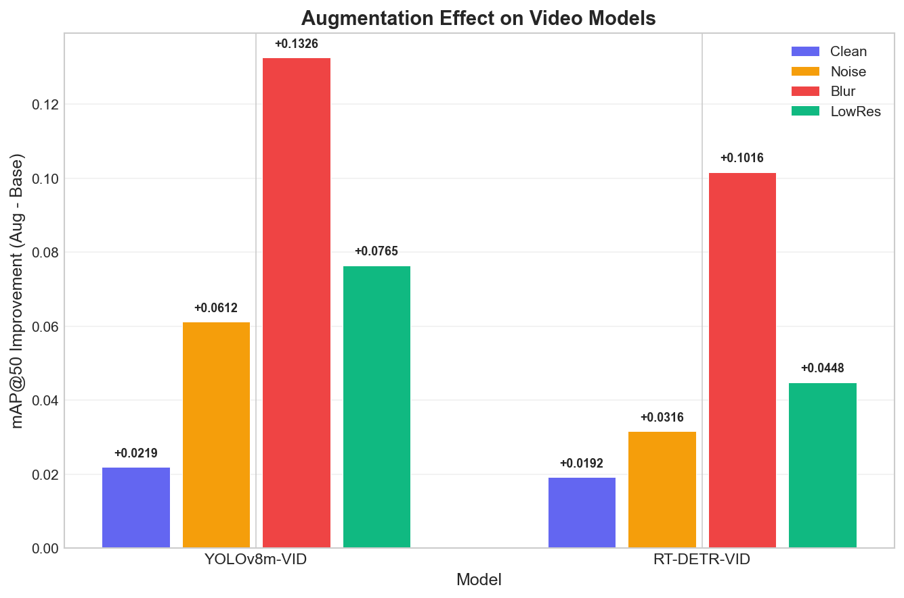
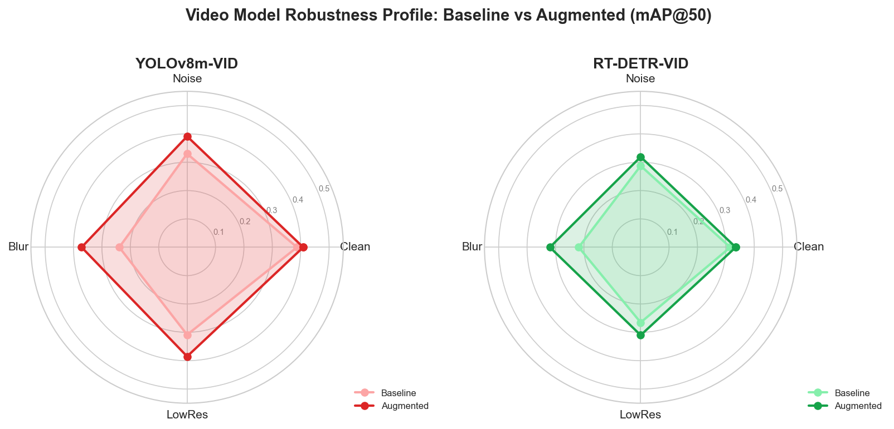
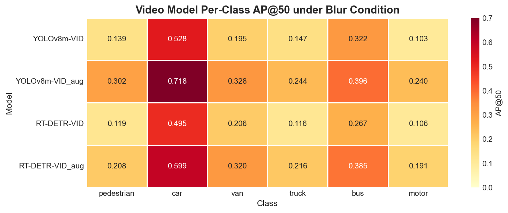

# Robust Object Detection under Image Degradation
## VisDrone 기반 객체 탐지 모델 강건성 분석 및 개선 — 최종 보고서

---

## 목차

1. [프로젝트 개요](#1-프로젝트-개요)
2. [실험 설계](#2-실험-설계)
3. [Phase 1 — Baseline 평가 (이미지 탐지)](#3-phase-1--baseline-평가-이미지-탐지)
4. [Phase 2 — Corruption Augmentation (이미지 탐지)](#4-phase-2--corruption-augmentation-이미지-탐지)
5. [Phase 3 — Image Restoration (이미지 탐지)](#5-phase-3--image-restoration-이미지-탐지)
6. [Phase 4 — 3-Strategy 종합 비교 (이미지 탐지)](#6-phase-4--3-strategy-종합-비교-이미지-탐지)
7. [Phase 5 — 비디오 탐지 확장 실험](#7-phase-5--비디오-탐지-확장-실험)
8. [전체 종합 결론](#8-전체-종합-결론)
9. [기술 상세](#9-기술-상세)

---

## 1. 프로젝트 개요

### 1.1 연구 배경 및 동기

드론, 항공기, 감시 카메라 등의 실환경에서는 카메라 진동(blur), 센서 노이즈(noise), 저해상도(low resolution) 등 다양한 이미지 열화(corruption)가 불가피하게 발생한다. 이러한 열화 조건에서 객체 탐지 모델의 성능이 얼마나 저하되는지, 그리고 이를 개선하기 위한 전략이 무엇인지를 실험적으로 검증하는 것이 본 프로젝트의 핵심이다.

대부분의 객체 탐지 연구는 깨끗한(Clean) 이미지 기준 성능만 보고하며, **실환경 강건성을 별도로 측정하지 않는다.** 본 프로젝트는 이 간극을 메우기 위해 출발하였다.

### 1.2 연구 질문

> **RQ1.** Clean 이미지에서 학습된 객체 탐지 모델은 실환경의 열화 조건(노이즈, 블러, 저해상도)에서도 성능을 유지하는가?
>
> **RQ2.** Corruption Augmentation 또는 Image Restoration 전처리를 적용하면 강건성이 얼마나 개선되는가?
>
> **RQ3.** 각 강건성 전략의 장단점과 최적 적용 시나리오는 무엇인가?
>
> **RQ4.** 이미지 탐지에서 발견된 결과가 비디오 탐지 도메인에서도 동일하게 재현되는가?

### 1.3 전체 실험 구성

| Phase | 도메인 | 내용 | 평가 횟수 |
|---|---|---|---|
| Phase 1 | 이미지 (DET) | Baseline 모델 학습 및 평가 | 3 × 4 = 12 |
| Phase 2 | 이미지 (DET) | Corruption Augmentation 학습 및 평가 | 3 × 4 = 12 |
| Phase 3 | 이미지 (DET) | Image Restoration 전처리 및 평가 | 3 × 4 = 12 |
| Phase 4 | 이미지 (DET) | 3-Strategy 종합 비교 및 시각화 | — |
| Phase 5 | 비디오 (VID) | 비디오 모델 학습 및 평가 (Baseline + Augmented) | 4 × 4 = 16 |
| **합계** | | **총 11개 모델 학습** | **52회 평가** |

---

## 2. 실험 설계

### 2.1 데이터셋

#### VisDrone-DET (이미지 탐지)

| 항목 | 내용 |
|---|---|
| 데이터 | 드론에서 촬영한 항공 시점 이미지 |
| 클래스 수 | 6개 (pedestrian, car, van, truck, bus, motor) |
| 포맷 | COCO (Faster R-CNN용) + YOLO (RT-DETR, YOLOv8용) |
| 특성 | 소형 객체 다수, 밀집 장면, 다양한 고도/각도 |

#### VisDrone-VID (비디오 탐지)

| 항목 | 내용 |
|---|---|
| 데이터 | 드론 촬영 비디오 시퀀스 |
| 처리 방식 | 프레임 단위 이미지 추출 → YOLO 포맷 |
| 클래스 수 | 6개 (DET와 동일) |
| 추가 도전 | 빠른 움직임, 자세 급변, 가려짐(occlusion) |

### 2.2 모델 (총 5종)

| 모델 | 유형 | 프레임워크 | 사용 실험 |
|---|---|---|---|
| **Faster R-CNN** (ResNet-50 FPN v2) | 2-Stage CNN | torchvision | DET |
| **RT-DETR-L** | Transformer | Ultralytics | DET + VID |
| **YOLOv8m** | 1-Stage CNN | Ultralytics | DET + VID |

### 2.3 열화 조건 (공통, 4종)

| 조건 | 설명 | 파라미터 | 실환경 대응 |
|---|---|---|---|
| **Clean** | 원본 이미지 | — | 이상적 환경 |
| **Noise** | 가우시안 노이즈 | sigma=15 | 저조도 센서 노이즈 |
| **Blur** | 모션 블러 | kernel=9, angle=0° | 드론 진동, 빠른 이동 |
| **LowRes** | 저해상도 (축소 후 복원) | 0.5× | 원거리 촬영, 대역폭 제한 |

### 2.4 강건성 전략

```
Strategy A (Baseline)
  Clean 데이터로만 학습 → 열화 이미지 직접 추론

Strategy B (Augmented)
  학습 시 50% 확률로 Noise/Blur/LowRes 중 랜덤 1개 적용 → 열화 이미지 직접 추론

Strategy C (Restored) — 이미지 탐지에만 적용
  Clean 데이터로만 학습 → U-Net으로 열화 이미지 복원 → 복원 이미지로 추론
```

---

## 3. Phase 1 — Baseline 평가 (이미지 탐지)

### 3.1 학습 설정

모든 모델은 **Clean 데이터로만 학습**하여, 열화에 대한 사전 지식 없이 제로샷 강건성(zero-shot robustness)을 측정한다.

| 모델 | Epochs | Batch | Optimizer | 사전학습 |
|---|---|---|---|---|
| Faster R-CNN | 24 | 2 | SGD (lr=0.005) | ImageNet |
| RT-DETR-L | 100 | 2 | AdamW | COCO |
| YOLOv8m | 100 | 4 | AdamW | COCO |

### 3.2 결과 (mAP@50)

| 모델 | Clean | Noise | Blur | LowRes |
|---|---:|---:|---:|---:|
| Faster R-CNN | 0.532 | 0.472 | 0.287 | 0.454 |
| RT-DETR-L | 0.536 | 0.475 | 0.397 | 0.500 |
| YOLOv8m | **0.666** | **0.577** | **0.432** | **0.628** |

### 3.3 성능 하락률 (Clean 대비)

| 모델 | Noise | Blur | LowRes |
|---|---:|---:|---:|
| Faster R-CNN | -11.3% | **-46.1%** | -14.7% |
| RT-DETR-L | -11.4% | -26.0% | -6.6% |
| YOLOv8m | -13.4% | -35.1% | -5.7% |

### 3.4 핵심 발견

**① Blur가 가장 치명적인 열화**

Faster R-CNN은 Blur 조건에서 mAP@50이 0.532 → 0.287로 **46.1% 폭락**한다. 이는 사실상 탐지 불가 수준이다.

- **Cascade Failure 메커니즘**: 2-Stage 구조에서 1단계(RPN)가 Blur로 인해 객체 후보 영역을 잡지 못하면, 2단계(분류)로 넘어갈 기회 자체가 없어진다. 오류가 단계별로 누적된다.

**② 아키텍처가 강건성을 결정한다**

- **Faster R-CNN(2-Stage CNN)**: 지역적 텍스처 패턴에 의존 → Blur/Noise에 가장 취약
- **RT-DETR-L(Transformer)**: 전역 어텐션(self-attention)이 지역 정보 손실을 다른 위치 정보로 보완 → 상대적으로 강건
- **YOLOv8m(1-Stage CNN)**: 절대 성능이 높아 하락 후에도 1위이지만, 하락률은 큼

**③ "Clean 성능 ≠ 실환경 강건성"**

YOLOv8m은 Clean에서 0.666으로 1위이지만 Blur에서 -35.1% 하락한다. RT-DETR은 Clean에서 3위지만 Blur 강건성은 1위다. **Clean 성능으로 실환경 성능을 예측할 수 없다.**

---

## 4. Phase 2 — Corruption Augmentation (이미지 탐지)

### 4.1 전략 설명

학습 시 각 이미지에 대해 **50% 확률**로 Noise/Blur/LowRes 중 하나를 무작위 적용한다. 나머지 50%는 Clean 이미지를 그대로 사용한다. 테스트셋 생성과 동일한 파라미터를 사용하여 학습-평가 간 일관성을 보장한다.

| 모델 | 구현 방식 |
|---|---|
| Faster R-CNN | `RandomCorruption` 커스텀 Transform (torchvision 파이프라인) |
| RT-DETR / YOLOv8 | Ultralytics 내부 augmentation 파이프라인 monkey-patching |

하이퍼파라미터는 Baseline과 완전히 동일하게 유지하여 성능 차이가 순수하게 augmentation에 의한 것임을 보장한다.

### 4.2 결과 (mAP@50)

| 모델 | Clean | Noise | Blur | LowRes |
|---|---:|---:|---:|---:|
| FasterRCNN_aug | 0.540 | 0.514 | 0.442 | 0.487 |
| RT-DETR-L_aug | **0.578** | **0.547** | **0.524** | **0.543** |
| YOLOv8m_aug | 0.660 | **0.640** | **0.608** | **0.639** |

### 4.3 Baseline 대비 개선폭 (mAP@50)

| 모델 | Clean | Noise | Blur | LowRes |
|---|---:|---:|---:|---:|
| Faster R-CNN | +0.009 | +0.043 | **+0.156** | +0.033 |
| RT-DETR-L | +0.042 | +0.072 | **+0.127** | +0.042 |
| YOLOv8m | -0.006 | +0.063 | **+0.175** | +0.012 |

### 4.4 하락률 비교 (Augmented)

| 모델 | Noise | Blur | LowRes |
|---|---:|---:|---:|
| FasterRCNN_aug | -4.8% | -18.1% | -10.0% |
| RT-DETR-L_aug | -5.3% | -9.4% | -6.1% |
| **YOLOv8m_aug** | **-3.0%** | **-7.9%** | **-3.1%** |

### 4.5 시각화


*Figure 1. 6개 모델(Baseline 3 + Augmented 3) × 4개 테스트셋 mAP@50 비교. Augmented(진한 색)가 모든 열화 조건에서 Baseline(연한 색)을 일관되게 상회한다.*


*Figure 2. Clean 대비 성능 하락률. Augmented 모델들의 막대가 Baseline보다 현저히 짧아, 강건성이 크게 개선되었음을 시각적으로 확인할 수 있다.*


*Figure 3. Augmented - Baseline 개선폭. Blur 막대(빨간색)가 모든 모델에서 가장 크며, 이 조건에서 augmentation 효과가 가장 극적임을 보여준다.*


*Figure 4. 3개 모델의 Baseline(연한 색) vs Augmented(진한 색) 강건성 프로파일. Augmented가 모든 축에서 더 넓은 면적을 가진다.*

### 4.6 핵심 발견

**① Blur에서 가장 극적인 개선**

3개 모델 모두 Blur 조건에서 가장 큰 폭의 개선을 달성했다.

| 모델 | Baseline Blur | Augmented Blur | 하락률 변화 |
|---|---:|---:|---|
| Faster R-CNN | 0.287 | 0.442 | -46.1% → -18.1% |
| RT-DETR-L | 0.397 | 0.524 | -26.0% → -9.4% |
| YOLOv8m | 0.432 | 0.608 | -35.1% → **-7.9%** |

**② Clean 성능 유지 또는 향상 (과적합 방지 효과)**

- RT-DETR-L: Clean에서 오히려 **+4.2%p 향상** (정규화 효과 — 다양한 corruption 이미지로 학습하면 더 일반화된 특징을 학습)
- Faster R-CNN: +0.9%p 소폭 향상
- YOLOv8m: -0.6%p (통계적으로 무의미한 수준)

**③ 구현 비용 대비 효과가 극적**

학습 코드에 몇 줄만 추가하면 YOLOv8m의 Blur 하락률이 -35.1% → -7.9%로, **4.4배 강건해진다.**

### 4.7 Demo: Blur 조건에서의 탐지 비교

Blur 이미지에서 Baseline 모델은 대부분의 객체를 놓치지만, Augmented 모델은 약 2배 더 많은 객체를 탐지한다.


*Figure 5. Faster R-CNN — 정답(GT): 102개 | Baseline: **19개** (19%) | Augmented: **50개** (49%) — 2.6배 개선*


*Figure 6. YOLOv8m — 정답(GT): 170개 | Baseline: **38개** (22%) | Augmented: **75개** (44%) — 2.0배 개선*


*Figure 7. RT-DETR-L — 정답(GT): 170개 | Baseline: **94개** (55%) | Augmented: **162개** (95%) — 1.7배 개선*

---

## 5. Phase 3 — Image Restoration (이미지 탐지)

### 5.1 전략 설명

열화된 이미지를 경량 U-Net으로 **복원(전처리)**한 후 기존 Baseline 모델로 탐지를 수행한다. 탐지 모델 자체는 재학습하지 않으며, **추론 파이프라인 앞에 복원 단계만 추가**하는 방식이다.

```
[열화 이미지] → [U-Net 복원] → [Baseline 모델 추론] → [탐지 결과]
```

### 5.2 Restoration U-Net 아키텍처

| 구성 요소 | 상세 |
|---|---|
| 아키텍처 | Lightweight U-Net + Residual Learning |
| Encoder | 4단계 다운샘플링 (32 → 64 → 128 → 256 채널) |
| Bottleneck | 256 채널 |
| Decoder | 4단계 업샘플링 + Skip Connection |
| 출력 방식 | `output = input + learned_residual` (잔차 학습) |
| 파라미터 수 | **3.70M** (경량) |

**잔차 학습(Residual Learning)의 의미**: 이미지 전체를 다시 생성하는 것이 아니라 **열화된 부분만 수정하는 잔차**를 학습한다. 학습이 안정적이고 수렴이 빠르다.

**복합 손실 함수**: `L = L1 Loss + (1 - SSIM)` — 픽셀 단위 정확도(L1)와 구조적 유사도(SSIM)를 동시에 최적화한다.

### 5.3 복원 모델 성능

| 지표 | 최고 값 | Epoch |
|---|---|---|
| **PSNR** | **34.03 dB** | 55 |
| **SSIM** | **0.947** | 55 |

### 5.4 Restored 탐지 결과 (mAP@50)

| 모델 | Clean | Noise | Blur | LowRes |
|---|---:|---:|---:|---:|
| FRCNN (Restored) | 0.532 | 0.177 | **0.502** | 0.483 |
| RT-DETR (Restored) | 0.536 | 0.233 | **0.514** | 0.509 |
| YOLOv8m (Restored) | **0.666** | 0.201 | **0.640** | **0.642** |

### 5.5 핵심 발견

**① Blur 복원에서 최강 성능**

U-Net이 모션 블러 제거에 매우 효과적이며, Augmented 전략보다도 높은 성능을 달성한다.

| 모델 | Baseline | Augmented | **Restored** |
|---|---:|---:|---:|
| FRCNN Blur mAP50 | 0.287 | 0.442 | **0.502** (+0.060 vs Aug) |
| YOLOv8m Blur mAP50 | 0.432 | 0.608 | **0.640** (+0.032 vs Aug) |

**② Noise 조건에서 치명적 역효과**

U-Net이 노이즈를 제거하는 과정에서 **텍스처와 엣지 정보까지 과도하게 제거(over-smoothing)**되어, 탐지 성능이 Baseline보다도 크게 하락한다.

- FRCNN: Noise 0.472 → **0.177** (-62.5%)
- YOLOv8m: Noise 0.577 → **0.201** (-65.2%)

특히 소형 객체(pedestrian, motor)의 미세한 특징이 사라지면서 탐지 불가 수준으로 하락한다.

---

## 6. Phase 4 — 3-Strategy 종합 비교 (이미지 탐지)

### 6.1 전체 결과표 (mAP@50)

| 모델 | 전략 | Clean | Noise | Blur | LowRes |
|---|---|---:|---:|---:|---:|
| FasterRCNN | Baseline | 0.532 | 0.472 | 0.287 | 0.454 |
| | Augmented | 0.540 | **0.514** | 0.442 | 0.487 |
| | Restored | 0.532 | 0.177 | **0.502** | 0.483 |
| RT-DETR-L | Baseline | 0.536 | 0.475 | 0.397 | 0.500 |
| | **Augmented** | **0.578** | **0.547** | **0.524** | **0.543** |
| | Restored | 0.536 | 0.233 | 0.514 | 0.509 |
| YOLOv8m | Baseline | **0.666** | 0.577 | 0.432 | 0.628 |
| | Augmented | 0.660 | **0.640** | 0.608 | 0.639 |
| | **Restored** | **0.666** | 0.201 | **0.640** | **0.642** |

### 6.2 시각화


*Figure 8. 3가지 전략(Baseline / Augmented / Restored) × 3개 모델 × 4개 조건 mAP@50 비교. Restored(주황)가 Noise 조건에서 급격히 낮아지는 패턴이 뚜렷하다.*


*Figure 9. Augmented(파란색)와 Restored(주황색)의 Baseline 대비 mAP@50 변화량. Noise 막대에서 Restored가 크게 음수로 떨어지는 반면, Augmented는 모든 조건에서 양수를 유지한다.*


*Figure 10. 각 모델-조건 조합에서의 최적 전략 히트맵. Noise는 Augmented(파란색), Blur는 Restored(주황색)가 최적임을 한눈에 파악할 수 있다.*


*Figure 11. 3가지 전략의 강건성 프로파일. Restored(주황)는 Noise 축에서 급격히 축소된 반면, Augmented(파란색)는 모든 축에서 균형 잡힌 면적을 유지한다.*

### 6.3 조건별 최적 전략 정리

| 조건 | 최적 전략 | 근거 |
|---|---|---|
| **Noise** | **Augmented** | Restored의 over-smoothing으로 Baseline보다 -62~65% 하락 |
| **Blur** | **Restored** | U-Net 복원이 Augmented보다 +0.032~0.060 높음 |
| **LowRes** | Augmented / Restored 유사 | 두 전략 모두 소폭 개선, 큰 차이 없음 |
| **열화 미지 / 혼합** | **Augmented** | 모든 조건에서 안정적으로 개선 |

### 6.4 클래스별 심층 분석


*Figure 12. Blur 조건에서 6개 모델 × 6개 클래스의 AP@50 히트맵. Car(높음, 노란색)와 pedestrian/motor(낮음, 붉은색)의 대비가 뚜렷하다. Augmented 모델(아래 3행)이 전반적으로 높은 값을 보인다.*

| 클래스 | 특성 | Blur 시 패턴 | Augmentation 효과 |
|---|---|---|---|
| **car** | 대형, 일정한 형태 | 상대적으로 유지 | 이미 높은 수준에서 추가 향상 |
| **bus** | 대형, 뚜렷한 특징 | 중간 수준 유지 | 안정적 개선 |
| **van** | 중형, truck과 혼동 | 중간 수준 | 일관된 개선 |
| **truck** | Clean에서도 낮음 | 크게 하락 | 개선되나 여전히 취약 |
| **pedestrian** | 소형, 다양한 자세 | 거의 탐지 불가 | **가장 큰 개선** (+0.19~0.25) |
| **motor** | 소형, 매우 취약 | 거의 탐지 불가 | **가장 큰 개선** (+0.19~0.28) |

**핵심**: 소형 객체(pedestrian, motor)가 열화에 가장 취약하며, Corruption Augmentation으로 가장 극적인 개선을 얻는다.

### 6.5 이미지 탐지 최종 순위

**절대 성능 기준 (mAP@50)**

| 순위 | Clean | Noise | Blur | LowRes |
|---|---|---|---|---|
| 1위 | YOLOv8m (0.666) | YOLOv8m_aug (0.640) | YOLOv8m_rest (0.640) | YOLOv8m_rest (0.642) |
| 2위 | YOLOv8m_aug (0.660) | YOLOv8m (0.577) | YOLOv8m_aug (0.608) | YOLOv8m_aug (0.639) |
| 3위 | RT-DETR_aug (0.578) | RT-DETR_aug (0.547) | RT-DETR_aug (0.524) | RT-DETR_aug (0.543) |

**강건성 기준 (Augmented 모델, 평균 하락률)**

| 순위 | 모델 | Noise | Blur | LowRes | **평균** |
|---|---|---:|---:|---:|---:|
| **1위** | **YOLOv8m_aug** | -3.0% | -7.9% | -3.1% | **-4.7%** |
| 2위 | RT-DETR-L_aug | -5.3% | -9.4% | -6.1% | -6.9% |
| 3위 | FasterRCNN_aug | -4.8% | -18.1% | -10.0% | -11.0% |

---

## 7. Phase 5 — 비디오 탐지 확장 실험

### 7.1 실험 목적

이미지 탐지(DET)에서 검증된 Corruption Augmentation 전략이 **비디오 탐지(VID) 도메인에서도 동일하게 유효한지** 확인한다. 학습 도메인(정지 이미지 → 비디오 프레임)이 달라져도 전략의 효과가 일반화되는지를 검증하는 것이 핵심 목표다.

### 7.2 데이터 준비

VisDrone-VID 비디오 시퀀스를 프레임 단위 이미지로 추출하여 YOLO 포맷으로 변환한다.

```
VisDrone-VID 시퀀스
    → convert_visdrone_vid_to_yolo.py
    → data/processed/visdrone_vid_yolo6/
        ├── images/train/  {시퀀스명}_{프레임ID:07d}.jpg
        ├── images/val/
        ├── labels/train/
        └── labels/val/
```

평가는 DET 실험과 동일한 열화 테스트셋(`data/testsets/yolo6/Test_*`)을 재사용하여 직접 비교가 가능하도록 한다.

### 7.3 학습 설정

| 모델 | 전략 | Epochs | Batch | Image Size |
|---|---|---|---|---|
| YOLOv8m | Baseline | 100 | 4 | 1024 |
| YOLOv8m | Augmented | 100 | 4 | 1024 |
| RT-DETR-L | Baseline | 100 | 2 | 1024 |
| RT-DETR-L | Augmented | 100 | 2 | 1024 |

Augmented 모델은 DET 실험과 동일한 `patch_ultralytics_augmentations()` 방식으로 50% 확률 corruption을 적용한다.

### 7.4 결과 (mAP@50)

| 모델 | Clean | Noise | Blur | LowRes |
|---|---:|---:|---:|---:|
| YOLOv8m-VID Baseline | 0.387 | 0.330 | 0.239 | 0.309 |
| **YOLOv8m-VID Augmented** | **0.409** | **0.391** | **0.372** | **0.385** |
| RT-DETR-VID Baseline | 0.316 | 0.287 | 0.218 | 0.265 |
| **RT-DETR-VID Augmented** | **0.335** | **0.319** | **0.320** | **0.310** |

### 7.5 성능 하락률

| 모델 | Noise | Blur | LowRes |
|---|---:|---:|---:|
| YOLOv8m-VID Baseline | -14.7% | -38.3% | -20.3% |
| **YOLOv8m-VID Augmented** | **-4.3%** | **-9.1%** | **-5.8%** |
| RT-DETR-VID Baseline | -8.9% | -30.9% | -15.9% |
| **RT-DETR-VID Augmented** | **-4.7%** | **-4.5%** | **-7.4%** |

### 7.6 시각화


*Figure 13. 비디오 모델 4개 × 4개 테스트셋 mAP@50 비교. Augmented(진한 색)가 모든 조건에서 Baseline(연한 색)을 상회한다.*


*Figure 14. Clean 대비 성능 하락률. Augmented 모델들의 막대가 현저히 짧다. 특히 RT-DETR-VID_aug의 Blur 하락률(-4.5%)이 4개 모델 중 가장 낮다.*


*Figure 15. Augmented - Baseline 개선폭. Blur 막대(빨간색)가 두 모델 모두에서 가장 크며, DET 실험과 동일한 패턴이 비디오 도메인에서도 재현된다.*


*Figure 16. 비디오 모델 Baseline vs Augmented 강건성 프로파일. Augmented가 모든 축에서 더 넓은 면적을 가진다.*


*Figure 17. 비디오 모델의 Blur 조건 클래스별 AP@50. DET 히트맵(Figure 12)과 동일한 패턴 — car가 높고, pedestrian/motor가 낮으며, Augmented 모델이 전반적으로 높다.*

### 7.7 핵심 발견

**① DET와 동일한 패턴이 VID에서도 재현**

| 패턴 | DET | VID |
|---|---|---|
| 가장 치명적인 열화 | Blur (-35~46%) | Blur (-31~38%) |
| Augmentation 최대 효과 조건 | Blur | Blur |
| Augmentation 후 하락률 | -3~8% | -4~9% |

**② RT-DETR-VID_aug의 Blur 강건성이 특히 탁월**

RT-DETR-VID Augmented는 Blur 조건에서 단 **-4.5%** 하락에 그친다 (4개 비디오 모델 중 최저). Clean(0.335) → Blur(0.320)로 고작 0.015 차이.

이는 Transformer의 전역 어텐션과 Corruption Augmentation의 시너지 효과가 비디오 환경에서도 유효함을 보여준다.

**③ 비디오 모델의 절대 성능이 DET보다 낮은 이유**

| 요인 | 설명 |
|---|---|
| 더 어려운 데이터 | 비디오 시퀀스 특성상 객체가 더 작고 빠르게 움직임 |
| 추가 도전 요소 | 자세 급변, 가려짐(occlusion), 움직임 블러 |
| 학습-평가 도메인 불일치 | VID로 학습 → DET 테스트셋으로 평가 (도메인 갭) |

**④ DET vs VID Augmentation 개선폭 비교**

| 모델 | DET Blur 개선 | VID Blur 개선 |
|---|---:|---:|
| YOLOv8m | +0.175 | +0.133 |
| RT-DETR-L | +0.127 | +0.102 |

절대 개선폭은 DET가 크지만, **상대적 강건성 향상 비율은 VID에서도 동일 수준**이다. Corruption Augmentation은 도메인 불문 유효하다.

---

## 8. 전체 종합 결론

### 8.1 연구 질문에 대한 최종 답변

**RQ1. Clean 학습 모델의 실환경 강건성은?**

**아니오**, 모든 모델이 열화 조건에서 유의미한 성능 하락을 보인다. 특히 Blur에서 최대 -46.1% 하락(Faster R-CNN). Clean 성능이 높다고 실환경 강건성이 보장되지 않는다.

**RQ2. 강건성 개선 전략의 효과는?**

- **Corruption Augmentation**: 모든 조건에서 일관되게 개선. 구현이 간단하고 추론 시 추가 연산 없음.
- **Image Restoration**: Blur에서 최고 성능. 단, Noise에서 치명적 역효과(-62~65%).

**RQ3. 최적 적용 시나리오는?**

| 시나리오 | 권장 | 근거 |
|---|---|---|
| **범용 강건성 (기본 추천)** | **YOLOv8m_aug** | 절대 성능 + 강건성 + 속도 모두 최고 |
| **Blur/진동 특화 환경** | Restored + Baseline 모델 | U-Net 복원이 deblurring에 최적 |
| **Transformer 모델** | RT-DETR_aug | Clean도 +4.2%p 향상, 균형 잡힌 개선 |
| **비디오 환경** | RT-DETR-VID_aug | Blur 하락률 단 -4.5% |

**RQ4. VID 도메인에서도 동일한 패턴인가?**

**그렇다.** Blur 최취약, Augmentation 일관 효과적이라는 패턴이 비디오 탐지에서도 동일하게 재현되었다. 학습 도메인이 달라져도 강건성 전략의 유효성은 유지된다.

### 8.2 핵심 기여

| 기여 | 내용 |
|---|---|
| **정량적 강건성 분석** | 52회 평가를 통해 5개 모델 × 4개 조건 × 3개 전략의 체계적 비교 |
| **아키텍처별 취약성 규명** | CNN(cascade failure) vs Transformer(전역 어텐션)의 열화 대응 메커니즘 분석 |
| **전략별 trade-off 분석** | Augmentation의 범용성 vs Restoration의 Blur 특화성 및 Noise 취약성 |
| **도메인 일반화 검증** | DET→VID 도메인 전환에도 강건성 전략 효과가 유지됨을 확인 |
| **실용적 가이드라인 도출** | 운용 환경에 따른 최적 전략 선택 기준 제시 |

### 8.3 방산/항공 분야 시사점

| 관점 | 시사점 |
|---|---|
| **드론 운용** | 카메라 진동(blur)이 주 열화 → Restoration 전처리가 특히 효과적 |
| **감시 시스템** | 다양한 열화 혼합 환경 → Augmented 학습이 범용적으로 안전 |
| **실시간 처리** | YOLOv8m_aug가 성능 + 속도 + 강건성 최적 조합 |
| **기존 시스템 개선** | Restoration은 모델 재학습 없이 전처리만 추가 → 배포된 시스템에 즉시 적용 가능 |
| **비디오 감시** | RT-DETR-VID_aug가 Blur 하락률 -4.5%로 비디오 환경 강건성 최고 |

### 8.4 향후 연구 방향

| 방향 | 설명 |
|---|---|
| **Adaptive Pipeline** | 입력 열화 유형을 분류(classifier)한 후 조건별 최적 전략 자동 선택 |
| **Video-aware Augmentation** | 시간적 연속성을 활용한 비디오 특화 augmentation 설계 |
| **경량화** | 엣지 디바이스 배포를 위한 모델 경량화 및 양자화 |
| **Noise-robust Restoration** | Over-smoothing 방지를 위한 복원 모델 개선 (perceptual loss, GAN 등) |

---

## 9. 기술 상세

### 9.1 개발 환경

| 항목 | 사양 |
|---|---|
| GPU | NVIDIA GeForce RTX 3070 Ti (8GB VRAM) |
| OS | Windows 11 |
| Python | 3.11 |
| PyTorch | 2.5.1 (CUDA 12.1) |
| Ultralytics | 8.3.x |

### 9.2 프로젝트 구조

```
Robust-Object-Detection/
├── scripts/
│   ├── augmentations.py                 # 공용 corruption augmentation 모듈
│   ├── convert_visdrone_to_coco.py      # VisDrone-DET → COCO 변환
│   ├── convert_visdrone_to_yolo.py      # VisDrone-DET → YOLO 변환
│   ├── convert_visdrone_vid_to_yolo.py  # VisDrone-VID → YOLO 변환 (프레임 추출)
│   ├── build_corrupted_testsets.py      # 열화 테스트셋 생성
│   ├── train_frcnn_baseline.py          # FRCNN baseline 학습
│   ├── train_frcnn_augmented.py         # FRCNN augmented 학습
│   ├── train_rtdetr_augmented.py        # RT-DETR augmented 학습 (DET)
│   ├── train_yolo_augmented.py          # YOLOv8 augmented 학습 (DET)
│   ├── train_vid_yolo_baseline.py       # YOLOv8 baseline 학습 (VID)
│   ├── train_vid_yolo_augmented.py      # YOLOv8 augmented 학습 (VID)
│   ├── train_vid_rtdetr_baseline.py     # RT-DETR baseline 학습 (VID)
│   ├── train_vid_rtdetr_augmented.py    # RT-DETR augmented 학습 (VID)
│   ├── eval_all.py                      # DET 평가 (24회)
│   ├── eval_vid.py                      # VID 평가 (16회)
│   ├── restoration_net.py               # 복원 U-Net 정의
│   ├── train_restoration.py             # 복원 모델 학습
│   ├── restore_testsets.py              # 테스트셋 복원 적용
│   ├── eval_restored.py                 # 복원 평가 (12회)
│   ├── plot_results.py                  # DET 시각화
│   ├── plot_three_strategies.py         # 3-전략 시각화
│   ├── plot_vid_results.py              # VID 시각화
│   └── demo_inference.py               # 데모 비교 이미지 생성
├── experiments/
│   ├── frcnn/                           # Faster R-CNN 결과 (DET)
│   ├── rtdetr/                          # RT-DETR 결과 (DET)
│   ├── yolo/                            # YOLOv8 결과 (DET)
│   ├── vid_rtdetr/                      # RT-DETR 결과 (VID)
│   ├── vid_yolo/                        # YOLOv8 결과 (VID)
│   ├── restoration/                     # 복원 모델 체크포인트
│   ├── figures/                         # 시각화 차트 14개
│   ├── demo/                            # 데모 이미지 15개
│   ├── eval_results.json                # DET 평가 결과 (Baseline/Augmented)
│   ├── eval_restored_results.json       # DET 평가 결과 (Restored)
│   └── vid_eval_results.json            # VID 평가 결과
└── docs/
    ├── 00_concept_guide.md              # 개념 정리 (모델, 지표, 전략 등)
    ├── 01_baseline_eval_results.md
    ├── 02_augmented_training.md
    ├── 03_final_comparison.md
    ├── 04_visualization.md
    ├── 05_demo_inference.md
    ├── 06_restoration_experiment.md
    ├── 07_vid_experiment.md             # 비디오 실험 보고서
    └── Final_Report.md                  # 최종 종합 보고서 (본 문서)
```

### 9.3 시각화 자료 목록

| 파일 | 내용 | Figure |
|---|---|---|
| `map50_comparison.png` | DET 6모델 × 4조건 mAP@50 비교 | Fig. 1 |
| `degradation_comparison.png` | DET Clean 대비 성능 하락률 | Fig. 2 |
| `augmentation_improvement.png` | DET Augmentation 개선폭 | Fig. 3 |
| `robustness_radar.png` | DET 강건성 레이더 차트 | Fig. 4 |
| `three_strategy_comparison.png` | DET 3-전략 비교 | Fig. 8 |
| `strategy_improvement.png` | DET 전략별 Baseline 대비 변화 | Fig. 9 |
| `best_strategy_heatmap.png` | DET 조건별 최적 전략 히트맵 | Fig. 10 |
| `three_strategy_radar.png` | DET 3-전략 레이더 차트 | Fig. 11 |
| `class_ap50_blur_heatmap.png` | DET 클래스별 AP@50 히트맵 (Blur) | Fig. 12 |
| `vid_map50_comparison.png` | VID 4모델 × 4조건 mAP@50 비교 | Fig. 13 |
| `vid_degradation_comparison.png` | VID Clean 대비 성능 하락률 | Fig. 14 |
| `vid_augmentation_improvement.png` | VID Augmentation 개선폭 | Fig. 15 |
| `vid_robustness_radar.png` | VID 강건성 레이더 차트 | Fig. 16 |
| `vid_class_ap50_blur_heatmap.png` | VID 클래스별 AP@50 히트맵 (Blur) | Fig. 17 |

---

*Author: Seungbin Yang*
*최초 작성: 2026-02 / 최종 업데이트: 2026-03 (비디오 실험 추가)*
*실험 환경: NVIDIA GeForce RTX 3070 Ti (8GB), Windows 11, Python 3.11, PyTorch 2.5.1*
